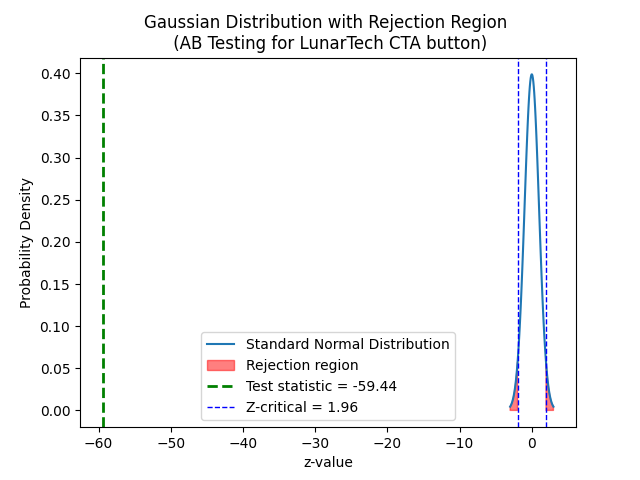

# A/B Testing Case Study Using Python.

### This Python script is designed to conduct a simulated A/B test, a commonly used method in statistics and data science for comparing two versions of a single variable. The objective is to determine which version performs better. This script serves as a practical case study to showcase A/B testing.

## Steps.
### 1. Simulating Click Data for A/B Testing.
### 2. Statistical Significance in A/B Testing.

## Application as a Case Study.

### A website is testing two different webpage designs to see which one results in higher user engagement, measured by clicks.

## Conclusion.

### THe z-critical value from the stndrd normal distribution: 1.959963984540054
### P-value of the 2 sample Z-test: 0.0
### There is statistical significance,indicating that the observed differences between the groups are unlikely to have occured by accident
### The confidence intrval of a 2-sample z-test: [np.float64(0.399), np.float64(0.426)]
### We have practical significance With an MDE of 0.1 the difference between control and experimental groups is practically sinificant.
### Lower bound of 95% confidence interval is  0.39

