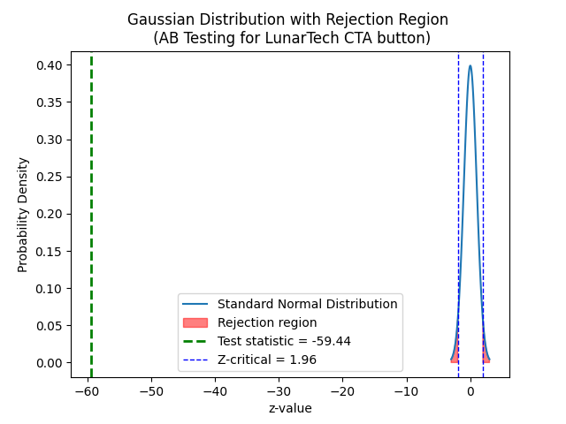

# A/B Testing Case Study Using Python.

### This Python script is designed to conduct a simulated A/B test, a commonly used method in statistics and data science for comparing two versions of a single variable. The objective is to determine which version performs better. This script serves as a practical case study to showcase A/B testing.

## Steps.
### 1. Simulating Click Data for A/B Testing.
### 2. Statistical Significance in A/B Testing.

## Application as a Case Study.

### A website is testing two different webpage designs to see which one results in higher user engagement, measured by clicks.

## Conclusion.

